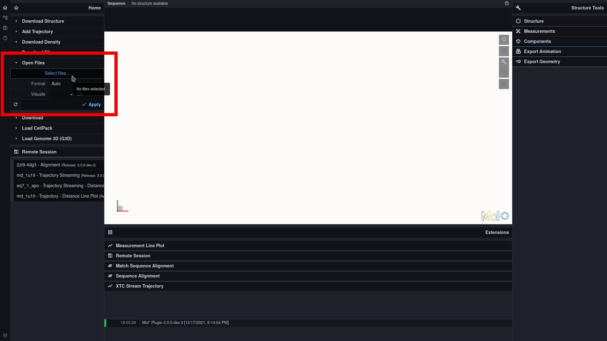
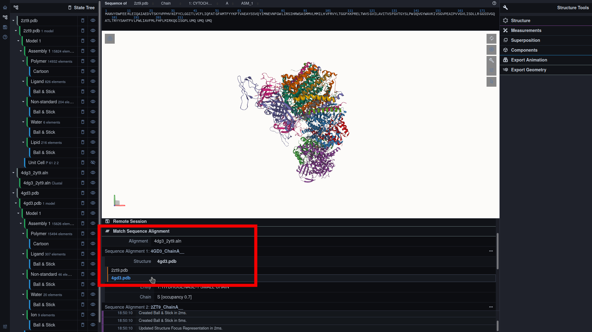
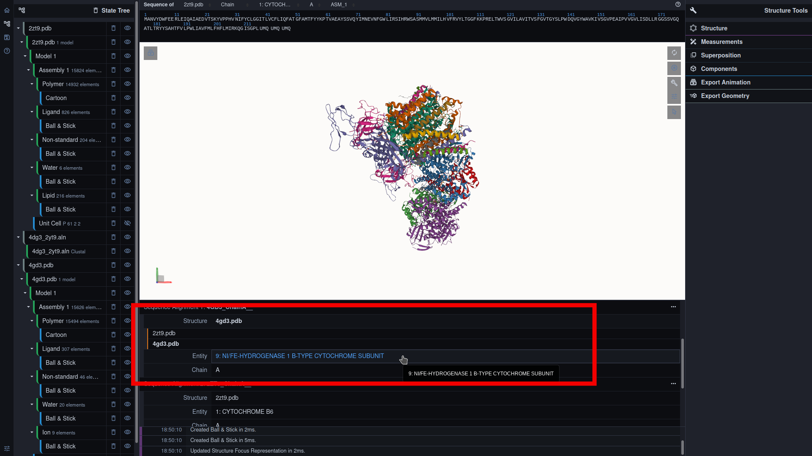
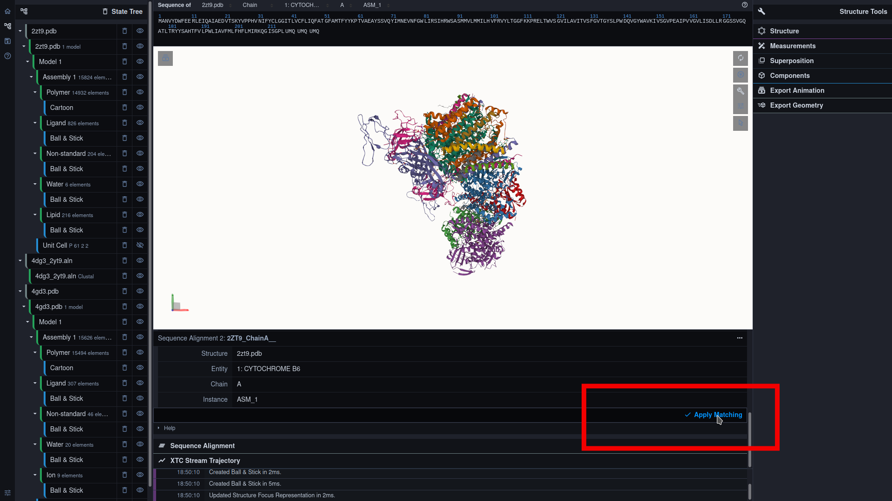

#### View Alignment:

Import a clustal alignmentand the corresponding pdb files:

Select correct chain for each pdb file:

Select correct entity for each pdb file:

Match the pdb files with the alignment:

***

Explore the sequence alignment:

Zooming by clicking an amino acid

***
