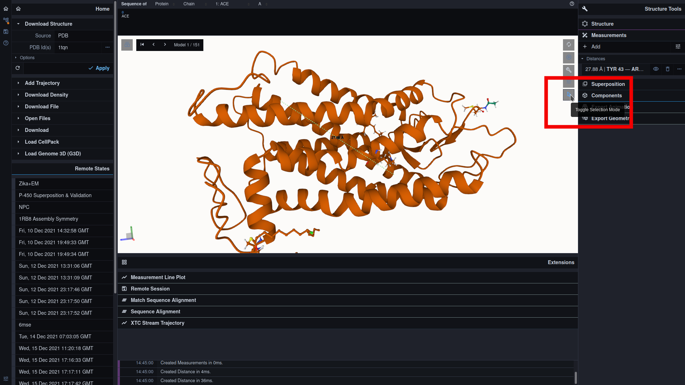
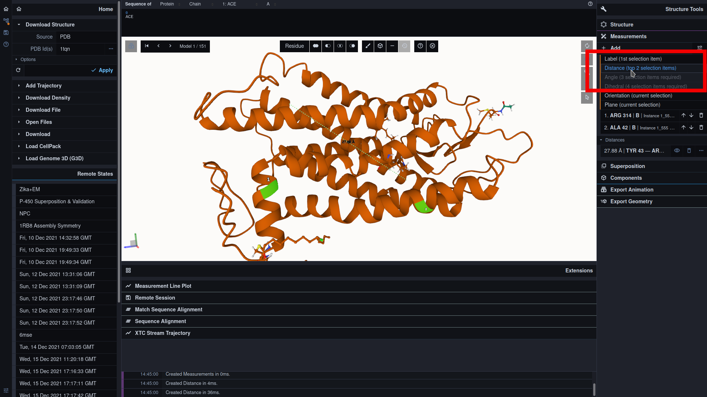
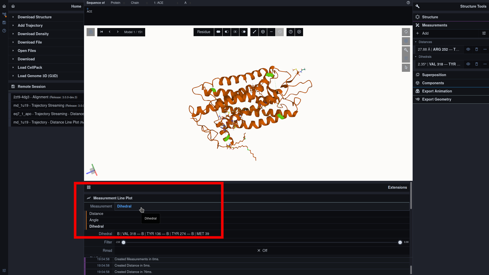

#### Distance Plots

Add a new distance pair

Toggle Selection Mode:

Select first mate:

Select second mate:

Toggle 'Add Menu':

Add mates as a distance pair:

Select distance pair for the plot visualization:

***

Explore the distance plot

Switch to RMSD plot

***

#### Angle Plots

Select three mates for an angle group and add them:

Select angle group for the plot visualization:

Explore the angle plot:

***

#### Dihedral Plots

Select four mates for a dihedral group and add them:

Select angle group for the plot visualization:

Explore the angle plot:
