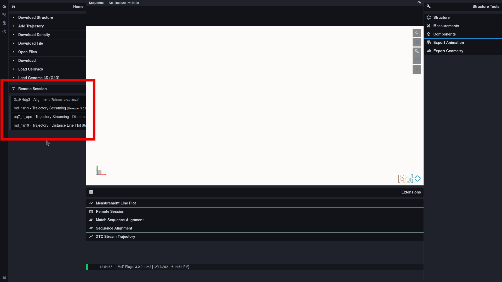
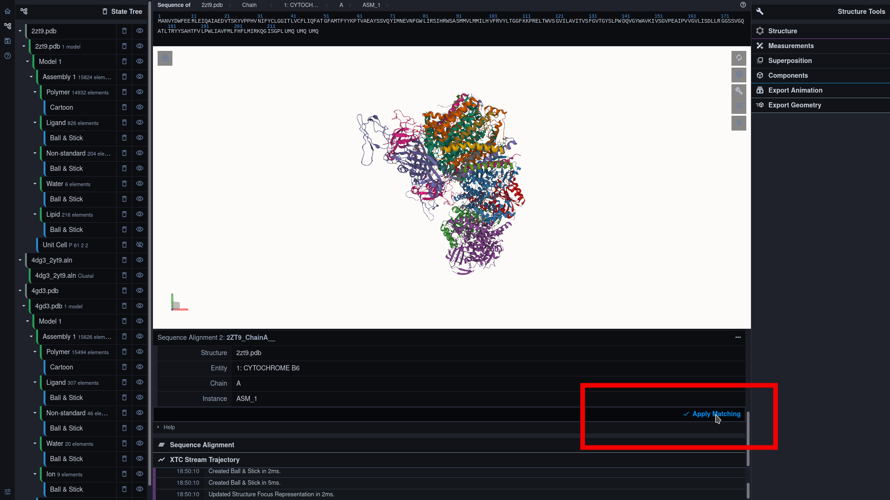
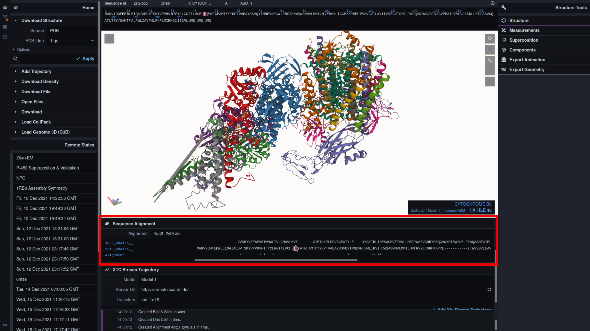
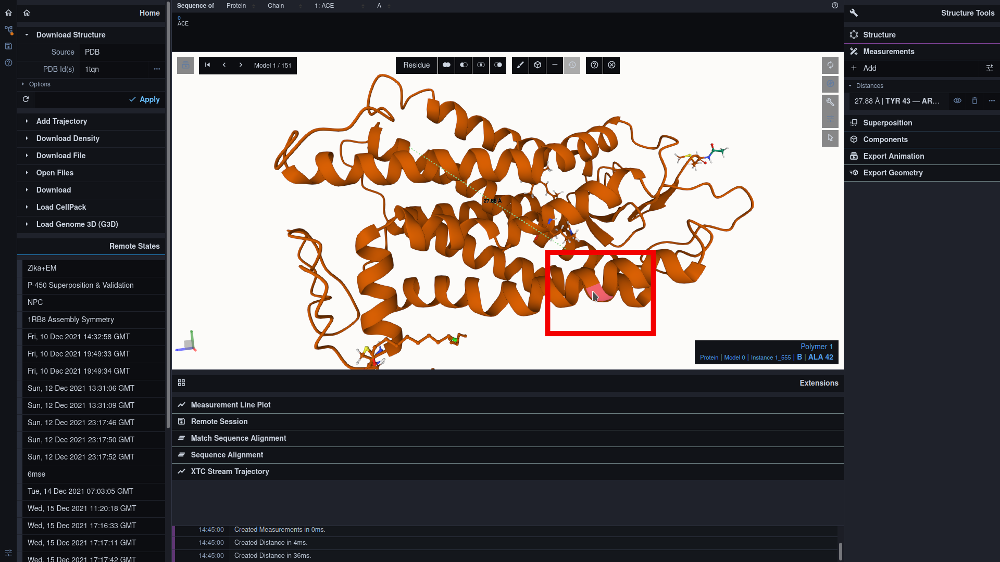
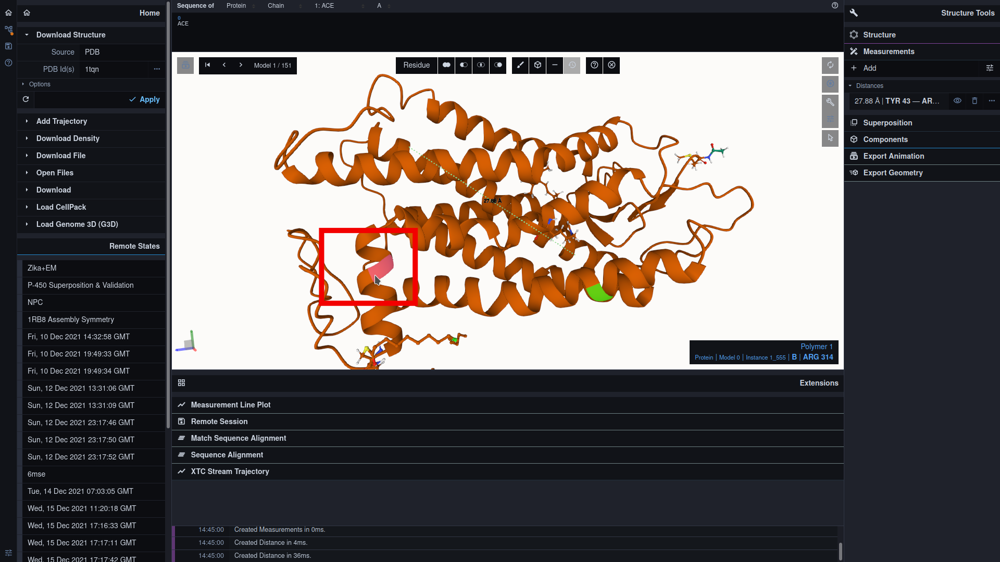
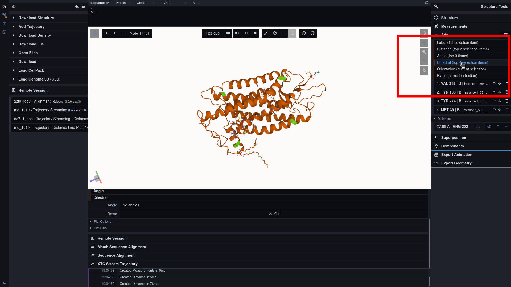
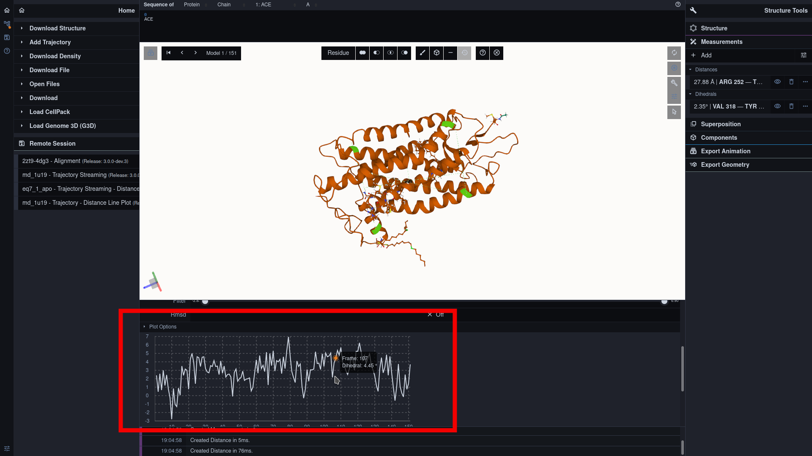

### FAQ:

#### Select Remote Session:

***

#### View Alignment:

Import a clustal alignmentand the corresponding pdb files:

Select correct chain for each pdb file:

Select correct entity for each pdb file:

Match the pdb files with the alignment:

***

Explore the sequence alignment:

Zooming by clicking an amino acid

***

#### Distance Plots

Add a new distance pair

Toggle Selection Mode:

Select first mate:

Select second mate:

Toggle 'Add Menu':

Add mates as a distance pair:

Select distance pair for the plot visualization:

***

Explore the distance plot

Switch to RMSD plot

***

#### Angle Plots

Select three mates for an angle group and add them:

Select angle group for the plot visualization:

Explore the angle plot:

***

#### Dihedral Plots

Select four mates for a dihedral group and add them:

Select angle group for the plot visualization:

Explore the angle plot:
