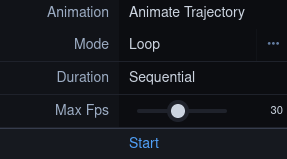

# FAQ:

<div class='faq'>

<!-- Import data  -->

## Import data

<a name='faq-import'></a>
<details>
    <summary>How can I import a structure or trajectory?</summary>
<p><div markdown="1">
You can find a detailed description on how to import structures and trajectories, inluding a video, in the tutorial section under:
- <a href="tutorial.html#tutorial-import-structure">Importing a structure</a>
- <a href="tutorial.html#tutorial-import-trajectory">Importing a trajectory</a>

There are several ways how a structure or a trajectory can be imported:
- **Open Local Files**: Import files that you have stored locally on your computer.
- **Open Remote Files**: Import files that are publicly available on a server. If you run the client locally on your computer, you can also import files from your local network this way.
- **Open Remote Structures**: Import strucures from public databases like the PDB using an identifier.
- **Open Remote Desity**: Import desities from public databases.
- **Load Trajectories**: Import trajectories by providing the files (structure and coordinates) from your local computer or by providing files that are publicly available on a server.
- **Zenodo Import**: Files from the Zenodo server cannot be imported using the above options. If you want to import Zenodo files, you must use this option and specify the record number for the files you want to import. Using this option all files of the record will be stored in the memory of your computer. If the files are too large, see: <a href="#faq-zenodo-large">The Zenodo record is too large to be held in my memory. How can I display the data?</a>.

</div></p></details>

<details>
    <summary>Can I upload both my own and public data?</summary>
<p><div markdown="1">
Yes, you can upload your own and public data. 
Check out the tutorials on:
- <a href="tutorial.html#tutorial-import-structure">Importing a structure</a>
- <a href="tutorial.html#tutorial-import-trajectory">Importing a trajectory</a>
</div></p></details>


<details>
    <summary>How to import data from other public servers (such as the Protein Data Bank)?</summary>
<p><div markdown="1">
It is possible to directly import data from public data bases like the PDB. Just follow the tutorial on <a href="tutorial.html#tutorial-import-structure">Importing a structure</a>.
</div></p></details>


<details>
    <summary>Can I import files from my local network?</summary>
<p><div markdown="1">
If you have the client deployed on your local machine, it is possible to import files from your local network using the _Open Remote Files_ feature.
</div></p></details>


<details>
    <summary>How can I import data from Zenodo?</summary>
<p><div markdown="1">
You can import data directly from Zenodo using the _Zenodo Import_ feature in the _Home Panel_ on the left. You just need to specify the _Record ID_ of the data and click the _Load Record_ button. After loading the files of the record, you can select which files you want to import. Select _Import File_ to load the data. (If you are importing a trajectory, you must specify a file for the topology and a file for the coordinates).
</div></p></details>


<details>
    <summary>How should I upload my data to Zenodo to optimize the processing of this data with MDsrv?</summary>
<p><div markdown="1">    
MDsrv can process the data from a Zenodo record, whether the files are stored as a compressed zip archive or as single files. 

- Zip: If the data is stored in a zip archive, all the files contained in this archive will be imported at the same time. It is not possible to select which of the files in the zip archive should be imported. 
- Single files: If the data is saved as individual files, it is possible to select which of the files should be imported. 

Therefore, we would currently recommend uploading the data files individually to Zenodo in order to have better control over which files can be imported with the current version of MDsrv.
</div></p></details>


<details>
    <summary>What does 'publicly available on another server' mean?</summary>
<p><div markdown="1">
Publicly accessible on another server means that this file can be accessed from anywhere on the internet. This does not apply, for example, to a file on a local network. If you try to import a file from a local network that is not accessible from outside into our MDsrv instance, it will not work. However, if you have MDsrv running on that local network, it is possible to import the files from the local network.
</div></p></details>


<details>
    <summary>Why do I not see a structure or trajectory?</summary>
<p><div markdown="1">
If you do not see a structure or trajectory after you imported it, there may have been an error during the importing process. Check the _Log_ at the bottom to identify possible errors.

If you imported a coordinate file of a trajectory, it will not be possible to visualize it. You need to use the _Load Trajectory_ menu to vizualize your trajectory. Follow the steps in the tutorial on <a href="tutorial.html#tutorial-import-trajectory">Importing a trajectory</a>.

If your structure or trajectory was visible before and now it is not, you may need to check the _State Tree_ to see if your structure or trajectory is still available. If you can find your structure or trajectory, check the _visibility toggle_ (eye icon) and turn it on if necessary. If your structure or trajectory is no longer available, you will need to import it again.
</div></p></details>


<a name='faq-zenodo-large'></a>
<details>
    <summary>The Zenodo record is too large to be held in my memory. How can I display the data?</summary>
<p><div markdown="1">
If the trajectory files in the dataset are too large to be stored in your memory, you can upload the trajectory to the MDsrv to stream it from there: <a href="tutorial.html#tutorial-upload-trajectory">Upload a trajectory to the MDsrv</a>. 
After uploading the trajectory to the server, import the structure from Zenodo (using the _Zenodo Import_) and match the trajectory stream to this structure: <a href="tutorial.html#tutorial-stream-trajectory">Stream a trajectory from the MDsrv</a>. 
</div></p></details>


<!-- trajectories -->

## Trajectories

<details>
    <summary>I tried to import data using an URL but it does not work. Why?</summary>
<p><div markdown="1">
The files of some websites cannot be accessed without an API. An error is displayed in the log window: _Failed to download data. Possible reasons: Resource is not available, or CORS is not allowed on the server._

For example, this error occurs when you try to import data from Zenodo using the _Open Remote File_ feature. The solution is to use the _Zenodo Import_ in the same panel.

If you are trying to import data from a website and this error occurs, it is possible that the files need to be accessed via an API and this function is not yet implemented. 
</div></p></details>


<details>
    <summary>I imported my trajectory file, but nothing is showing. Why?</summary>
<p><div markdown="1">
It is not possible to visualize your coordinate file if you imported it via the _Open Local Files_ or _Open Remote File_ menu.

You will need to import your trajectory using the _Load Trajectory_ Menu in the _Home_ panel on the left side. Just follow the tutorial on <a href="tutorial.html#tutorial-import-trajectory">Importing a trajectory</a>.
</div></p></details>


<details>
    <summary>How can I assign a coordinate file to a structure?</summary>
<p><div markdown="1">
You will need to import your trajectory using the _Load Trajectory_ Menu in the _Home_ panel on the left side. Just follow the tutorial on <a href="tutorial.html#tutorial-import-trajectory">Importing a trajectory</a>.
</div></p></details>


<a name='faq-vis-traj'></a>
<details>
    <summary>How can I visualize my trajectory?</summary>
<p><div markdown="1">
To visualize your trajectory follow the steps in the tutorials:
- <a href="tutorial.html#tutorial-import-trajectory">Importing a trajectory</a>
- <a href="tutorial.html#tutorial-stream-trajectory">Stream a trajectory from the MDsrv</a>
- <a href="tutorial.html#tutorial-play-trajectory">Playing a trajectory</a>
</div></p></details>


<details>
    <summary>How do I play my trajectory?</summary>
<p><div markdown="1">
You can find a detailed description on how to play a trajectory, inluding a video, in the tutorial section under <a href="tutorial.html#tutorial-play-trajectory">Playing a trajectory</a>.
</div></p></details>


<details>
    <summary>Can I change the play mode of the trajectory?</summary>
<p><div markdown="1">

Yes you can. After importing and assigning you trajectory, the _Select Animation_ button will appear.

<center></center>

1. Select the button to open an additional menu for changing the plan mode of the trajectory.
    <center></center>
2. Select _Start_ to play the trajectory.
</div></p></details>


<details>
    <summary>Why is only part of my trajectory moving? Why is there an overlapping?</summary>
<p><div markdown="1">
You propbably imported your trajectory via the _Match Trajectory Stream_ menu to stream your trajectory from the MDsrv. The overlapping occurs, because the static structure is still visible. You need to clean up your visualization. Open the _State Tree_ on the left and turn off the visibility for your static structure to which you assigned the trajectory stream.

For a more detailed description on how to clean up the visulation after you assigned a trajectory for streaming to a structure, you can check out the tutorial on <a href="tutorial.html#tutorial-stream-trajectory">Stream a trajectory from the MDsrv</a>.
You can also look at the FAQ: <a href="#faq-visibility">How do I change the visibility of a structure, trajectory or other component?</a>.
</div></p></details>


<!-- trajectory streaming -->

## Trajectory streaming

<details>
    <summary>How can I upload my trajectory to MDsrv?</summary>
<p><div markdown="1">
You can upload a trajectory to the MDsrv for streaming. Note that the trajectory must be publicly available on a server. Follow the steps in the tutorial <a href="tutorial.html#tutorial-upload-trajectory">Upload a trajectory to the MDsrv</a>.
</div></p></details>


<details>
    <summary>My trajectory is too large to be displayed and the viewer crashed. What now?</summary>
<p><div markdown="1">
To visualize and share large trajectories, you either need to set up your own server or upload the trajectory to our MDsrv.

To set up your own MDsrv, check out the <a href="install.html">Install</a> page.

To upload the trajectory to our server, check out the tutorial <a href="tutorial.html#tutorial-upload-trajectory">Upload a trajectory to the MDsrv</a>.
</div></p></details>


<details>
    <summary>Where is my trajectory stored when I upload it to the MDsrv.</summary>
<p><div markdown="1">
When you upload a trajectory using the _Add Trajectory to Streaming Server_ menu in the viewer (frontend) of MDsrv, the trajectory is uploaded and stored on the streaming server.
</div></p></details>


<details>
    <summary>How do I stream a trajectory from the MDsrv?</summary>
<p><div markdown="1">
You can find a detailed description on how to stream a trajectory from the MDsrv, inluding a video, in the tutorial section under <a href="tutorial.html#tutorial-stream-trajectory">Stream a trajectory from the MDsrv</a>.
</div></p></details>


<details>
    <summary>How can I visualize trajectories that are stored on another server that is not an MDsrv?</summary>
<p><div markdown="1">
You can import this trajectory using its URL. Follow the steps in the tutorial on <a href="tutorial.html#tutorial-import-trajectory">Importing a trajectory</a>.

If the trajectory is too large to vizualize it this way, you can upload it to our MDsrv by follow the steps in the tutorial <a href="tutorial.html#tutorial-upload-trajectory">Upload a trajectory to the MDsrv</a>.

You can also set up your own MDsrv to stream the trajectory. Check out the <a href="install.html">Installation</a> page.
</div></p></details>


<!-- session -->

## Sessions

<a name='faq-share-session'></a>
<details>
    <summary>How can I share the session I have prepared?</summary>
<p><div markdown="1">
You can share your session in two ways. A detailed description on how to share a session, inluding a video, can be found in the tutorial section under <a href="tutorial.html#tutorial-share-session">Sharing a session</a>.
</div></p></details>


<details>
    <summary>How do I get the URL to my saved session?</summary>
<p><div markdown="1">
After you saved your session to the MDsrv, you have to right-click on your session in the session list. A new tab will open with the URL you want to share.

For a more detailed description on how to save a session to the MDsrv and obtain the URL for sharing your session, you can check out the tutorial on <a href="tutorial.html#tutorial-share-session">Sharing a session</a>.
</div></p></details>


<details>
    <summary>How can I share my trajectory?</summary>
<p><div markdown="1">
You can share your trajectory by sharing your session. Check out the Tutorial <a href="tutorial.html#tutorial-share-session">Sharing a session</a>.
</div></p></details>


<details>
    <summary>Do I have to install MDsrv myself to visualize and share my trajectories?</summary>
<p><div markdown="1">
No, you can use our server to visualize and share your trajectories. You can find different Tutorials on how to import and share structures and trajectories on the <a href="tutorial.html">Tutorial</a> page.
</div></p></details>


<details>
    <summary>How to upload local data (from my computer) to a running server?</summary>
<p><div markdown="1">
To upload the data you have locally stored on your computer you first have to import the data into the client and prepare a session to your desires. Then you can store this session on a running server by following the steps in the tutorial on <a href="tutorial.html#tutorial-share-session">Sharing a session</a>.

If you want to upload a trajectory to the MDsrv, because it is too large to vizualize without the client crashing, you can upload the trajectory to the MDsrv by following the steps in the tutorial <a href="tutorial.html#tutorial-upload-trajectory">Upload a trajectory to the MDsrv</a>.
</div></p></details>


<details>
    <summary>I developed a really nice representation and perspective on my trajectory. How do I save this and make it available for others?</summary>
<p><div markdown="1">
Check out the FAQ: <a href="#faq-share-session">How can I share the session I have prepared?</a>
</div></p></details>


<details>
    <summary>Can I download and import my session from one server to another? </summary>
<p><div markdown="1">
Yes, you can! Simply open your session via _Remote Session_ from the server where you saved it. After you have opened your session, you just need to upload it to the other server where you want to save it via _Remote Session_ menu by changing the _Server Url_.
</div></p></details>


<details>
    <summary>Can I reference the source of the data I used in my session?</summary>
<p><div markdown="1">
You can specify the sources of the data used in the session. You can use the _Source_ and _Description_ field for this purpose. 
</div></p></details>


<details>
    <summary>How long are remote sessions available that I upload to the server?</summary>
<p><div markdown="1">
After a session is uploaded to the MDsrv, any user can delete the session by selecting the _Bin_ button on the right side of the session in the _Remote Session_ menu. 
Currently, sessions will be stored up to 4 weeks on our server as long as it is not deleted by another user. This may change in the future.
</div></p></details>


<details>
    <summary>How can I make a session permanent on a server?</summary>
<p><div markdown="1">
Currently, only the host of the server can flag a session as permanent by adding the ```ìsSticky``` flag to the session's entry. After adding the flag, the _Bin_ button next to the session will disappear and other users will not be able to delete your session. Only the host of the server can do this.

If you are not the host of the server, you must contact the host of the server and request that your session be flagged as sticky. 

If you are the host of the server, refer to the <a href="install.html">Install</a> page for further description. 
</div></p></details>


<details>
    <summary>How can I delete a permanent session?</summary>
<p><div markdown="1">
Currently, only the host of the server can delete a permanent session. The session can be removed as a permanent session by removing the ```ìsSticky``` flag in the session entry, or it can be deleted completely by removing the entire entry from the ```session_index.json``` file.

If you are not the host of the server, you must contact the host of the server and request that your session should be deleted.

If you are the host of the server, refer to the <a href="install.html">Install</a> page for further description. 
</div></p></details>


<details>
    <summary>Someone used my data for a session. What now?</summary>
<p><div markdown="1">
If your data has been used for a session and you would like the session to be deleted, you can do so by clicking the _Bin_ button on the right side of the session. If it is a permanent session, please contact the host of the server and request the session to be deleted.
</div></p></details>


<!-- alignment -->

## Alignment

<details>
    <summary>How can I import an alignment?</summary>
<p><div markdown="1">
Import the Clustal file (_.aln_) using the _Open Local Files_ menu in the _Home_ panel on the left-hand side. 

To match the alignemnt to structures, check out the tutorial on <a href="tutorial.html#tutorial-alignment">Superpose structures based on a sequence alignment</a>.
</div></p></details>


<details>
    <summary>How can I add a sequence alignment</summary>
<p><div markdown="1">
You can find a detailed description on how to add a sequence alinment, inluding a video, in the tutorial section under <a href="tutorial.html#tutorial-alignment">Superpose structures based on a sequence alignment</a>.
</div></p></details>


<details>
    <summary>How to superpose two or more structures based on an already calculated alignment?</summary>
<p><div markdown="1">
You can find a detailed description on how to align two or more structures based on an already calculated alignment, inluding a video, in the tutorial section under <a href="tutorial.html#tutorial-alignment">Superpose structures based on a sequence alignment</a>.
</div></p></details>


<details>
    <summary>Can I superpose structures and trajectories without having to upload an alignment?</summary>
<p><div markdown="1">
Yes.
1. Import the structures or trajectories you want to superpose. 
2. Open the _Structure tool_ panel on the right side. 
3. Open the _Superposition_ menu. 
4. Choose if you want to superpose by _Chain_ or _Atoms_.
5. Select the needed structures as described in the _Superposition_ menu.
6. Select the _Superpose_ button.
</div></p></details>


<!-- plot and measurement -->

<details>
    <summary>How do I add a measurement?</summary>
<p><div markdown="1">
You can find a detailed description on how to add a measurement, inluding a video, in the tutorial section under <a href="tutorial.html#tutorial-measurement">Add a time-trace plot of a measurement for a trajectory</a>. The first part of the tutorial describes how a measurement is added. 
</div></p></details>


<details>
    <summary>How can I add a measurement to my trajectory?</summary>
<p><div markdown="1">
You can find a detailed description on how to add a measurement to a trajectory, inluding a video, in the tutorial section under <a href="tutorial.html#tutorial-measurement">Add a time-trace plot of a measurement for a trajectory</a>. The first part covers the adding of a measurement to the trajectory.
</div></p></details>


<a name='faq_measurement_fix'></a>
<details>
    <summary>I added a measurement to my trajectory, but it is not updating when I change the frame?</summary>
<p><div markdown="1">
If you imported your trajectory via the _Load Trajectory_ menu, this should not happen.

If you imported your trajectory correctly using the _Match Trajectory Stream_ feature, you may not have cleaned up your visualization and added the measurement to your static structure to which you assigned the trajectory stream.

If you have cleaned up the visualization and this still occurs, you probably selected the structures for your measurement using the _Sequence View_ at the top. Even if you have cleaned up the visualization, the _Sequence View_ still contains all the sequences from the static structure, and you probably added the measurement to it. To change the sequences in the _Sequence View_ to your trajectory, select the drop-down menu to the right of _Sequence of_. The tricky part is that they both have the same name. Once you have selected your trajectory in the _Sequence View_, make sure that the visibility of your static structure is turned off. Then hover over the sequence in the _Sequence View_ and check to see if the corresponding residues are highlighted in the displayed trajectory. If so, then the sequences in the _Sequence View_ are from your trajectory. Now you can add the measurement again.

<!-- <center>
    <figure class='video_container'>
        <video width='75%' controls='true' allowfullscreen='true' poster='./videos/poster/measurement_fix.png'>
            <source src='./videos/measurement_fix.mp4' type='video/mp4'>
        </video>
    </figure>
</center> -->
</div></p></details>


<details>
    <summary>I added a measurement to my trajectory, but there is no time-trace plot available?</summary>
<p><div markdown="1">
If you imported your trajectory via the _Load Trajectory_ menu, this should not happen.

If you imported your trajectory correctly using the _Match Trajectory Stream_ menu, you may not have cleaned up your visualization and added the measurement to your static structure to which you assigned the trajectory stream to.

To fix your problem, check out the steps in FAQ: <a href="#faq_measurement_fix">I added a measurement to my trajectory, but it is not updating when I change the frame?</a>
</div></p></details>


<!-- other -->

## Other

<details>
    <summary>Do I need a public IP to share data with the world?</summary>
<p><div markdown="1">
To make your server globally visible you need a public IP. Otherwise it is only visible to devices within your local network.
</div></p></details>


<a name='faq_selection_mode_button'></a>
<details>
    <summary>Where do I find the <i>Toggle Selection Mode</i> button?</summary>
<p><div markdown="1">
<center></center>
</div></p></details>


<a name='faq-visilibity'></a>
<details>
    <summary>How do I change the visibility of a structure, trajectory or other component?</summary>
<p><div markdown="1">
Each component in the _State Tree_ in the left panel has a visibility toggle. By selecting this button, you can turn on or off he visibility for this component.
<center></center>
</div></p></details>


<details>
    <summary>I want to select a chain or atom and not focus on it. How?</summary>
<p><div markdown="1">

If you are trying to select a structures, but the camera is always focusing on it, you forgot to toggle the _Selction Mode_. To active the _Selection Mode_, click the _Toggle Selection Mode_ button (check out the FAQ on <a href="#faq_selection_mode_button">Where do I find the <i>Toggle Selection Mode</i> button?</a>). The _Selection Mode_ is active as long as the _Selection Mode Menu_ is visible at the top of the white canvas. 
<center></center>
</div></p></details>


<details>
    <summary>How can I change the coloring and representation of my molecules?</summary>
<p><div markdown="1">
There are multiple ways to change the coloring of the representation of your molecules.
You can descide between changing the color of a whole component or just a selection you made.

- To change the color of a whole component:
    1. Open the _Components_ menu in the _Structure Tools_ panel on the right side. 
    2. There you will find a list of all components in the scene. 
        <center></center>
    3. Select the _Options_ button for the component you want to color (button with three dots). A submenu will appear. 
        <center></center>
        <center></center>
    4. Select _Set Coloring_ and choose the coloring of your liking. 
        <center></center>

- If you only want to change the color of a single part of one Model:
    1. Open the _State Tree_ panel on the left side.
    2. Find the representation you want to change the coloring for. 
        <center></center>
    3. Select the repesentation. A sub menu will appear under it. 
    4. Select _Update 3D Representation_ to open another sub menu. 
        <center></center>
    5. Now you can choose the coloring of your liking. 
        <center></center>

- It is also possible to change the color of a selection you made:
    1. Select the _Toggle Selection Mode_ button. 
        <center></center>
    2. Select the part of your structure you want to color.
    3. Select the _Apply Theme to Selection_ button. 
        <center></center>
    4. Choose a color of your liking.
    5. Select the _Apply theme_ button. 
</div></p></details>


<details>
    <summary>I selected an amino acid in the <i>Sequence View</i> at the top to zoom into my trajectory, but I get an overlay of another structure. Why is this happening?</summary>
<p><div markdown="1">
This can happen if you have not selected the correct structure for the _Sequence View_. Select the drop-down menu on the right side of the _Sequence of_ dialog in the _Sequence View_ to change which structure or trajectory is displayed in it. Check that the correct sequence is displayed by hovering the over the residues and check that they are highlighted appropriately in the visible trajectory. If so, you have selected the correct trajectory for the _Sequence View_. Now, if you select the amino acid in the _Sequence View_ again, you should not get an overlay.
</div></p></details>


<details>
    <summary>I only want a specific part of my structure to be visible, how do I achieve this?</summary>
<p><div markdown="1">    

<center>
    <figure class='video_container'>
        <video width='75%' controls='true' allowfullscreen='true' poster='./videos/poster/components.png'>
            <source src='./videos/components.mp4' type='video/mp4'>
        </video>
    </figure>
</center>
</div></p></details>


<details>
    <summary>Can I download my viszualization as an image or video?</summary>
<p><div markdown="1">
If you want to save your scene as an image, preprare the scene as you want to save it. Then select the _Screenshot_ button and select _Download_ to save the image.
<center></center>

You can also download an animation for your scene.
1. Open the _Structure Tools_ panel on the right side.
2. Open the _Export Animation_ menu.
    - There are multiple animations available:
        - Animate Trajectory
        - Camera Spin
        - Camera Rock
        - State Snapshots
        - Unwind Assembly
        - Spin Structure
    <center></center>

3. Change the options as wanted.
4. Select _Render_.
5. Wait until the scene is rendered.
6. Select _Save Animation_ to download the video. 
    <center></center>

</div></p></details>


<details>
    <summary>How can I open and close the panels?</summary>
<p><div markdown="1">
There are multiple ways to open and close the menu panels.

On the far left side, you can find an overview for all panels:
<center></center>
- Home 
- State Tree
- Plugin Settings
- Help
- Log
- Extensions
- Structure Tools

On default, all panels are closed except for the _Log_ panel. Selecting the icon for the respective panel opens or closes it. The icon is displayed in white when the panel is open. 

<center></center>

Additionally, you can close the panels (except the _Log_) by clicking on their headers: 
<center></center>

You can open the left, _Extensions_, and _Strucure Tools_ panels by clicking on the buttons in the white canvas on their respective sides. 
<center></center>

</div></p></details>


<details>
    <summary>What options are available to customize a session?</summary>
<p><div markdown="1">
There are several ways you can customize your session:
- Translation and Rotation of structures/trajectories/components
- Adding measurements 
- Coloring structures/trajectories/components
- Turning off the visibility for structures/trajectories/components
- Showing only parts of structures/trajectories/components

For further details on possible customization options, please refert to the [documentation of Mol*](https://molstar.org/viewer-docs/).
</div></p></details>


<details>
    <summary>How fast can MDsrv stream a trajectory?</summary>
<p><div markdown="1">
We have tested the performance on 3 devices under the same conditions. The devices were connected to a local network via Ethernet and connected to the Internet with a connection of 100Mbit/s download per second. For the tests the browser Chrome was used on the devices.
The MDsrv servers were publicly accessible via the Internet and connected to the Internet with 1Gbit/s upload.

Device 1 is a high end client device (Intel Core i7-9750H, 64GB RAM, NVIDIA 2070RTX, Ubuntu 20.04). 
Device 2 is a standard client device (Intel Core i5-6200U, 8GB RAM, iGPU, ChromeOS).
Device 3 is a low end client device (Intel Pentium CPU 4415Y, 8GB RAM, iGPU, Windows 10)

We benchmarked the time to initialize and, if applicable, the time to stream frames of a trajectory for multiple sessions.


|      Highend      | Initialization time | Initialization size | Frame time | Framesize |
|:-----------------:|:-------------------:|:-------------------:|:----------:|:---------:|
|    Cholesterol    |       15000 ms      |        115MB        |      -     |     -     |
|   md_1u19 direct  |        471ms        |        3.3MB        |      -     |     -     |
| md_1u19 streaming |         89ms        |        142KB        |    41ms    |    47b    |
|     eq7_1_apo     |        371ms        |        2.3MB        |    41ms    |    90KB   |
| Trajectory Stream |        107ms        |         98KB        |    87ms    |   101KB   |

|      Standard     | Initialization time | Initialization size | Frame time | Framesize |
|:-----------------:|:-------------------:|:-------------------:|:----------:|:---------:|
|    Cholesterol    |       14310 ms      |        115MB        |      -     |     -     |
|   md_1u19 direct  |        459ms        |        3.3MB        |      -     |     -     |
| md_1u19 streaming |        101ms        |        142KB        |    86ms    |    47b    |
|     eq7_1_apo     |        403ms        |        2.3MB        |    76ms    |    90KB   |
| Trajectory Stream |         91ms        |         98KB        |    95ms    |   101KB   |

|      Lowend     | Initialization time | Initialization size | Frame time | Framesize |
|:-----------------:|:-------------------:|:-------------------:|:----------:|:---------:|
|    Cholesterol    |       33950 ms      |        115MB        |      -     |     -     |
|   md_1u19 direct  |        828ms        |        3.3MB        |      -     |     -     |
| md_1u19 streaming |        152ms        |        142KB        |    98ms    |    47b    |
|     eq7_1_apo     |        623ms        |        2.3MB        |    85ms    |    90KB   |
| Trajectory Stream |        192ms        |         98KB        |    87ms    |   101KB   |

The data shows that the time it takes to load a frame does not differ much between the devices, but it is noticeable that the time it takes to load the session 'Cholesterol' on the low-end device is much longer than on the other devices. However, this is due to the fact that the session is not streamed but has to be completely loaded locally into the frontend. Here the performance limitations of the low end device become visible.
The 4.5 GB session 'Trajectory Stream', in contrast, can be used on the low end device without major performance losses. 


</div></p></details>


</div>

If you have any further questions, please send an e-mail to: kampfrath@informatik.uni-leipzig.de 
