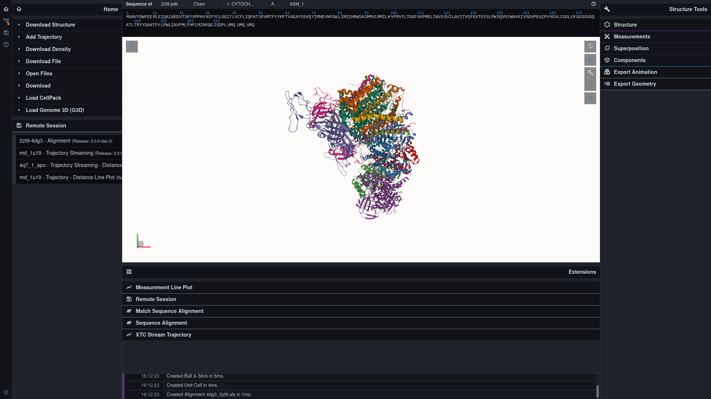

### Introduction

MDsrv is a web tool for interactive and remote exploration of trajectories. Interactive visualization of MD trajectories provides an instant, transparent, and intuitive understanding of  complex dynamics, while sharing of MD trajectories may generate transparency and trust, allowing collaboration, knowledge exchange, and data reuse.

<button onclick="window.location.href ='https://proteininformatics.informatik.uni-leipzig.de/?session-url=https%3A%2F%2Fremote.sca-ds.de%2Fget%2Fsession%2F80de2863-618b-4e4d-b811-316027fed991'">Start Demo Session</button>
  
  
      
   

<button onclick="window.location.href = 'https://proteininformatics.informatik.uni-leipzig.de'">Start new Session</button>
  
  
    

### Related Work

- NGL Viewer: a Web Application for Molecular Visualization. Rose AS, Hildebrand PW. Nucleic Acids Res. 2015 Jul 1;43(W1):W576-9. 
- MDsrv: Viewing and Sharing Molecular Dynamics Simulations on the Web. Tiemann JKS, Guixà-González R, Hildebrand PW, Rose AS. Nat Methods. 2017 Nov 30;14(12):1123-1124. 
- Bringing Molecular Dynamics Simulations into View. Hildebrand PW, Rose AS, Tiemann JKS. Trends Biochem Sci. 2019 Jul 10.
