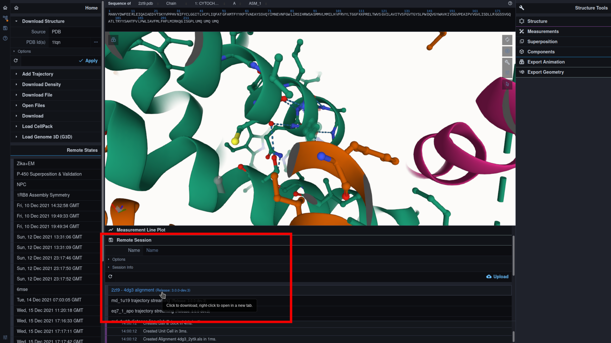
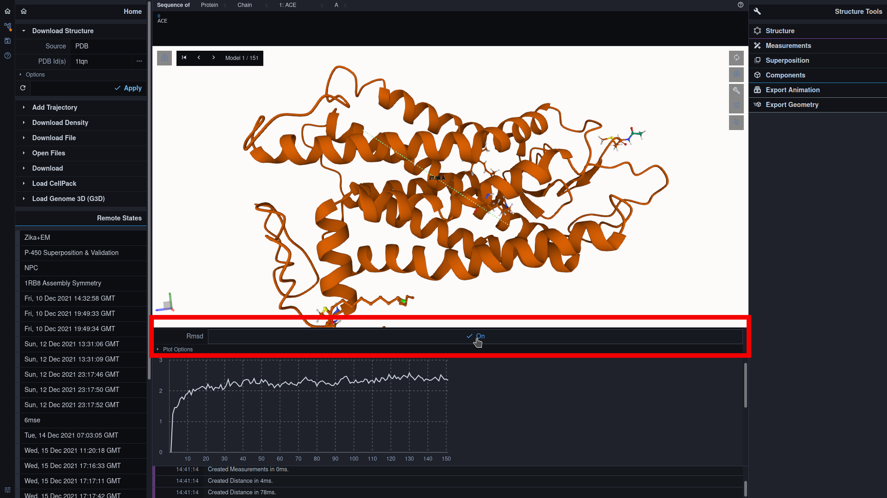

### Introduction

MDsrv is a web tool for interactive and remote exploration of trajectories. Interactive visualization of MD trajectories provides an instant, transparent, and intuitive understanding of  complex dynamics, while sharing of MD trajectories may generate transparency and trust, allowing collaboration, knowledgeexchange, and data reuse.

***

### Example sessions:

<a href="https://proteininformatics.informatik.uni-leipzig.de/?session-url=https%3A%2F%2Fremote.sca-ds.de%2Fget%2Fsession%2F9f89ab6d-cffe-4c62-bbfb-e04d2d4a1d17" target="_blank">Alignment View</a>

<a href="https://proteininformatics.informatik.uni-leipzig.de/?session-url=https%3A%2F%2Fremote.sca-ds.de%2Fget%2Fsession%2Ff77e13b6-00c8-4b2f-a752-3d7daf67526b" target="_blank">Trajectory Streaming 1</a>

<a href="https://proteininformatics.informatik.uni-leipzig.de/?session-url=https%3A%2F%2Fremote.sca-ds.de%2Fget%2Fsession%2F3d3ab076-db05-40f2-872b-5a9a4fe2f6e9" target="_blank">Trajectory Streaming 2</a>

<a href="https://proteininformatics.informatik.uni-leipzig.de/?session-url=https%3A%2F%2Fremote.sca-ds.de%2Fget%2Fsession%2F307061fb-a961-46bd-855f-dbb63a761857" target="_blank">RMSD Plot</a>

***

### FAQ:

#### Select Remote Session:

***

#### View Alignment:

Zooming by clicking an amino acid

***

#### Distance Plots

Switch to RMSD plot

***

Add a new distance pair

Toggle Selection Mode:

Select first mate:

Select second mate:

Toggle 'Add Menu':

Add mates as a distance pair:

Select distance pair for the plot visualization:

