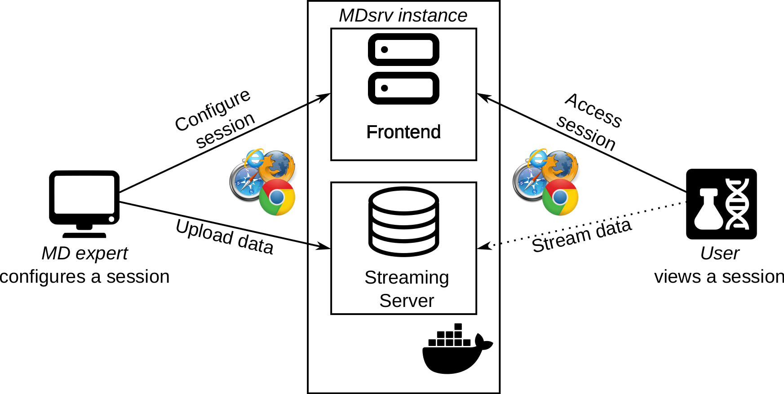

<center></center>

<a name="install"></a>
## How do I install a MDsrv instance on my machine (Setting up your own streaming server and frontend)?
We provide up-to-date images of the viewer (frontend) and streaming server available at Dockerhub. 

- [Viewer (frontend)](https://hub.docker.com/r/dwiegreffe/mdsrv-viewer)

- [Streaming Server](https://hub.docker.com/r/dwiegreffe/mdsrv-remote)

The images can also be created with the following instructions: 

- [https://github.com/dwiegreffe/mdsrv](https://github.com/dwiegreffe/mdsrv)

A description of Docker and how to use it can be found here: 

- [Docker](https://docs.docker.com/get-started/)

<a name="import-tr-md"></a>
## How do I add a trajectory to my own MDsrv streaming server?

1. Add your trajectory into the trajectory folder of your server.
2. Update the trajectory_index.json. 
An entry has the following format:
```
{
    "timestamp": 123,
    "id": "example_id",
    "name": "example_name",
    "description": "example_description"
}
```

Whereas the id ```example_id``` must be the name of the trajectory file in the trajectory directory, and the id must be unique.
Currently, only trajectories in the XTC format can be streamed.