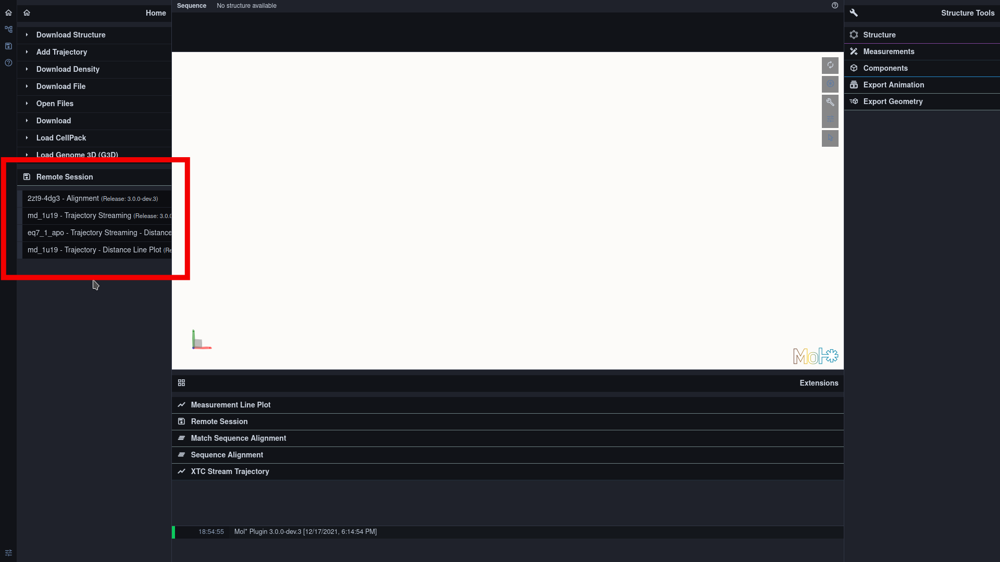
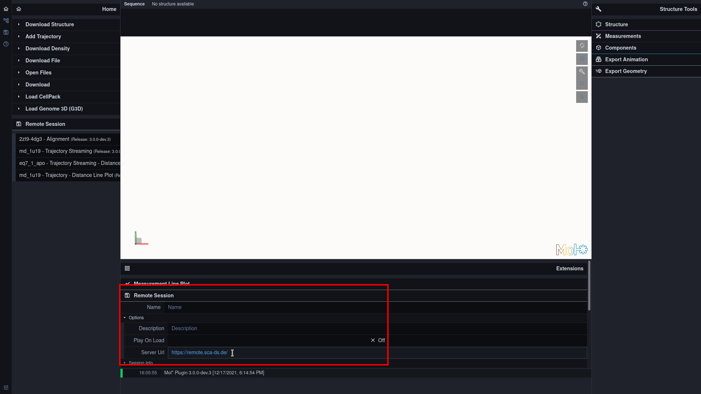

### Remote Sessions

In a remote session, the state of the client and the imported molecular structure data are stored on a remote session server and can be reloaded into the client at a later time.

#### Select Remote Session:

#### Create a new Remote Session:

To create a new session, open an empty client. Then one can add structures, trajectories or alignments and prepare them, e.g. by translation, rotation, adding measurements, etc. Once the session is prepared to ones liking, it can be saved to the server using the Upload button in the Remote Session Panel. Each session can be given a name and description to identify it at a later time. It is also possible to open a saved session, modify it further and save it again.

#### Select Remote Server:

If one wants to use one's own remote server to stream the trajectories, one can exchange the URL of the remote server:

